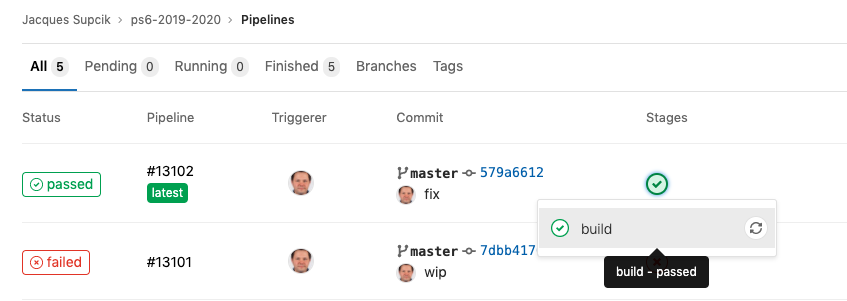
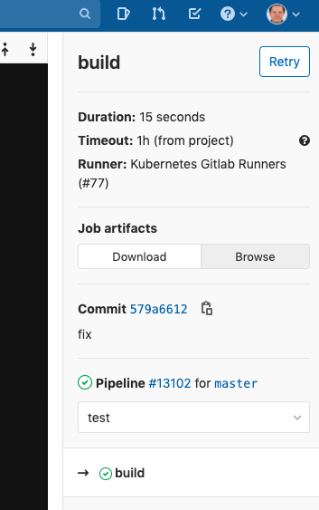
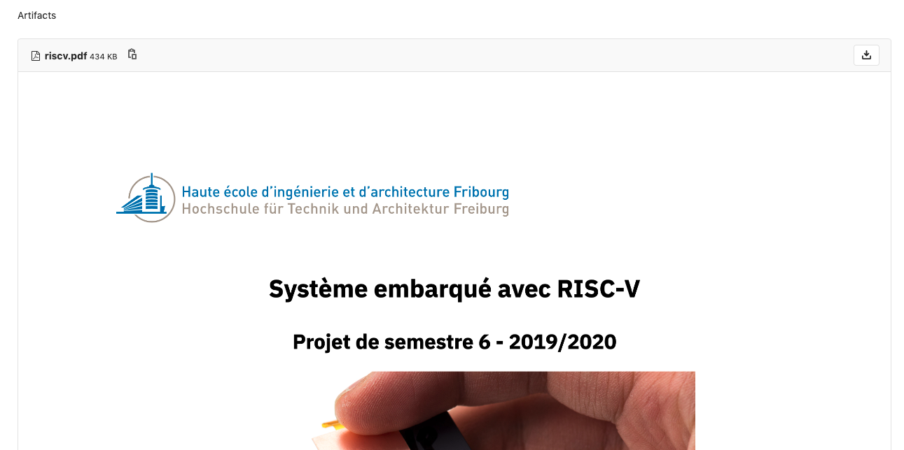

# Projetu

Système de publication des projets d'étudiants (projets de semestre, travaux de diplômes et projets de master)
à la Haute école d'ingénierie et d'architecture de Fribourg.

## Marche à suivre

Voici la marche à suivre pour proposer des projets:

- Créer un projet sur https://gitlab.forge.hefr.ch/, dans votre "namespace" (prénom.nom), avec le nom communiqué par le responsable de filière (par exemple `ps6-2019-2020`). Le projet peut être _public_, _internal_, ou alors _private_, mais dans ce dernier cas, le responsable de filière doit être ajouté aux membres du projet avec le rôle de _reporter_ (ou plus).
- Pour chaque projet, rédiger un fichier **avec l'extension `.md`**. Ce fichier se compose de deux parties:
  - Un "front matter" en _YAML_ avec les méta données du projet. Cette partie doit respecter le schéma [Kwalify](http://www.kuwata-lab.com/kwalify/) suivant : https://gitlab.forge.hefr.ch/jacques.supcik/projetu/-/blob/master/projetu/schemas/meta_v2.yml
  - La donnée du projet en markdown avec des sections telles que "Contexte", "Objectifs", "Contraintes".
  
  Voici un exemple pour un tel fichier

  ```
  ---
  version: 3
  title: Mon super projet
  type: Projet de bachelor
  academic_year: 2019/2020
  departments:
    - Informatique
    - Télécommunications
  orientations:
    - Internet et communication
  max_students: 1
  professorss:
    - Philippe Joye
  keywords: [IoT, Réseaux, Machine Learning]
  language: [F]
  confidential: non
  continuation: non
  ---
  ## Contexte

  Sit sint sit adipisicing excepteur cillum ullamco velit qui fugiat
  occaecat. Voluptate aliqua ex commodo aliqua commodo exercitation quis
  minim exercitation qui minim dolor. 
  
  ## Objectifs

  - Lorem ipsum
  - Dolor sit
  - Consectetuer
  - Adipiscing elit

  ## Contraintes

  - Diam
  - Nonummy nibh
  - Tincidunt
  ```

  Pour insérer une image, ajoutez l'image à votre projet et faites-y
  référence de la manière suivante (par exemple ici avec une image qui prendra 70% de la largeur du texte):

      ```{=tex}
      \begin{center}
      \includegraphics[width=0.7\textwidth]{img/pro.jpg}
      \end{center}
      ```

- Définissez un fichier `.gitlab-ci.yml` avec le contenu suivant:

```yaml
image: "registry.forge.hefr.ch/damien.goetschi/projetu:latest"

build:
  script:
    find . -type f | grep \.md$ | grep -v README | xargs projetu --author="$GITLAB_USER_NAME" --template=tb_v2.md
  artifacts:
    paths:
      - ./*.pdf
```
  - A chaque fois que vous ferez un `git commit` et que vous enverrez les changements sur gitlab (avec un `git push`), le CI/CD de gitlab produira les PDFs correspondants à vous fichiers. Assurez-vous que la compilation ne produise pas d'erreur.
  
## Exemple

le projet https://gitlab.forge.hefr.ch/jacques.supcik/ps6-2019-2020 montre
comment le système fonctionne.

Il y a la description de deux projets avec des images.

Pour voir le résultat, allez sur https://gitlab.forge.hefr.ch/jacques.supcik/ps6-2019-2020/pipelines, puis cliquez sur le "vu" vert, puis sur "build":



Ensuite cliquez sur "browse":



Et vous verrez le résultat (pdf) de vos fichiers:



## Compilation sur votre machine

Si vous souhaitez obtenir le PDF sans passer par le CI/CD de
gitlab, vous pouvez utiliser l'image Docker de la manière suivante:

1.  Installer Docker si vous ne l'avez pas encore
2.  Télécharger l'image Docker pour _projetu_
    ```
    docker login registry.forge.hefr.ch
    docker pull registry.forge.hefr.ch/jacques.supcik/projetu
    ```
3.  Compiler vos fichiers
    ```
    docker run --rm -ti -v $(pwd):/src -w "/src" \
      registry.forge.hefr.ch/jacques.supcik/projetu \
      bash -c "ls *.md | grep -v README | xargs \
        projetu --author=\"$(whoami)\" \
          --template=tb.md \
          --config /app/tb-2019-2020.yml"
    ```
    ou alors, pour un seul fichier à la fois:
    ```
    docker run --rm -ti -v $(pwd):/src -w "/src" \
      registry.forge.hefr.ch/jacques.supcik/projetu \
      projetu --author="MY NAME" \
        --template=tb.md --config /app/tb-2019-2020.yml \
        MY_PROJECT_FILE.md
    ```

Vous pouvez aussi faire sans Docker, mais il vous faudra installer tous les logiciels
sur votre machine : LaTeX, Pandoc, Python 3, ainsi que le code pour _projetu_.

## Note

Depuis la version 11.9.4 de gitlab, le téléversement d'image au travers de l'interface
web (et également avec le WebIDE) modifie les métadonnées des images:

https://about.gitlab.com/releases/2019/04/01/security-release-gitlab-11-dot-9-dot-4-released/#exif-geolocation-data-not-stripped-from-uploaded-images

Ceci à pour conséquence de "casser" LaTeX lorsque ces images sont utilisées. Ca se
traduit souvent par une erreur du genre :

```
 ! Package graphics Error: Division by 0.
 
 See the graphics package documentation for explanation.
 Type  H <return>  for immediate help.
 ...
 
 l.xxx ...{img/figure.jpg}
```

Si vous utilisez le WebIDE de gitlab et si vous avez ce genre d'erreur, vous
pouvez y remédier en corrigeant les images dans le pipeline du CI/CD à l'aide du programme `exiftool` (inclu dans l'image Docker à partir de la version 0.1.2)

votre `.gitlab-ci.yml` pourrait alors ressembler à ça:

```
image: "registry.forge.hefr.ch/jacques.supcik/projetu:latest"

build:
  script:
    ls img/* | xargs exiftool -jfif:Xresolution=300 -jfif:Yresolution=300 -jfif:ResolutionUnit=inches
    ls *.md | grep -v README | xargs projetu --author="$GITLAB_USER_NAME" --template=tb.md --config /app/tb-2019-2020.yml
  artifacts:
    paths:
      - ./*.pdf
```
